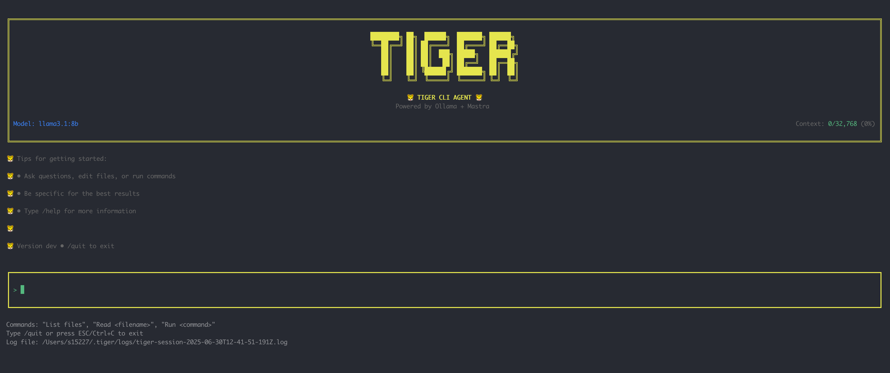

# Tiger CLI 🐯



A powerful CLI coding agent powered by Ollama and Mastra tools. Tiger helps you with various coding tasks through natural language interaction.

## Features

- 🤖 Natural language interface for coding tasks
- 🛠️ Built-in tools for file operations, shell commands, and more
- 📝 Session logging for debugging and audit trails
- 🎨 Beautiful terminal UI with Ink
- ⚡ Fast responses using local Ollama models

## Prerequisites

- Node.js 18+ 
- [Ollama](https://ollama.ai/) installed and running
- llama3.2:3b model (default) or any other Ollama model

```bash
# Install Ollama (macOS/Linux)
curl -fsSL https://ollama.ai/install.sh | sh

# Pull the default model
ollama pull llama3.2:3b
```

## Installation

### Local Development

```bash
# Clone the repository
git clone https://github.com/yourusername/tiger-cli.git
cd tiger-cli

# Install dependencies
npm install

# Run Tiger CLI
npm start
```

### Global Installation

```bash
# Install globally to use 'tiger' command anywhere
npm install -g .

# Now you can run Tiger from anywhere
tiger
```

## Usage

Once Tiger is running, you can interact with it using natural language:

```
🐯 Tiger CLI Agent
Powered by Ollama + Mastra

> List files in the current directory
> Read package.json
> Create a new file called hello.txt with "Hello World" content
> Run ls -la command
```

### Available Commands

Tiger understands natural language requests for:
- **File Operations**: List files, read file contents, create/edit files
- **Shell Commands**: Execute shell commands safely
- **Echo**: Test the agent with simple echo responses

### Keyboard Shortcuts

- `Enter` - Send your message
- `/quit` - Exit the application
- `ESC` or `Ctrl+C` - Exit the application

## Development

```bash
# Run in development mode
npm run dev

# Type checking
npm run typecheck

# Build the project
npm run build
```

## Project Structure

```
tiger-cli/
├── src/
│   ├── tiger-cli.mjs    # CLI entry point with Ink UI
│   ├── tiger.ts         # Core Tiger logic and Ollama integration
│   ├── tools/           # Mastra tool implementations
│   ├── logger.ts        # Session logging
│   └── config.ts        # Configuration
├── examples/            # Example usage and tests
└── test/               # Test files
```

## Configuration

Tiger can be configured using a `.tigerrc` file. The configuration is loaded in the following priority order:

1. Environment variables (highest priority)
2. `.tigerrc` or `.tigerrc.json` in current directory
3. `.tigerrc` or `.tigerrc.json` in home directory
4. `~/.tiger/config.json`
5. Default configuration (lowest priority)

### Configuration Options

Create a `.tigerrc` file in your project or home directory:

```json
{
  "model": "llama3.2:3b",      // Ollama model to use
  "timeout": 60000,            // Timeout for Ollama calls (ms)
  "maxIterations": 10,         // Max steps for multi-step tasks
  "temperature": 0.7,          // Model temperature (0-1)
  "logDir": "~/.tiger/logs",   // Log directory path
  "logEnabled": true,          // Enable/disable logging
  "logLevel": "info"           // Log level: info, debug, error
}
```

### Environment Variables

You can also use environment variables:

```bash
export TIGER_MODEL="llama3.2:7b"
export TIGER_TIMEOUT=120000
export TIGER_MAX_ITERATIONS=15
export TIGER_TEMPERATURE=0.8
```

### Available Models

Tiger works with any Ollama model. Popular options:
- `llama3.2:3b` (default) - Fast, good for coding
- `llama3.2:7b` - More capable
- `qwen2.5-coder:7b` - Specialized for coding
- `deepseek-coder-v2:16b` - Powerful coding model

To use a different model:
1. Pull it with Ollama: `ollama pull qwen2.5-coder:7b`
2. Set it in `.tigerrc`: `{"model": "qwen2.5-coder:7b"}`

## Contributing

Contributions are welcome! Please feel free to submit a Pull Request.

## License

MIT License - see LICENSE file for details

## Acknowledgments

- Built with [Ollama](https://ollama.ai/) for local LLM inference
- UI powered by [Ink](https://github.com/vadimdemedes/ink)
- Tools framework by [Mastra](https://mastra.dev/)