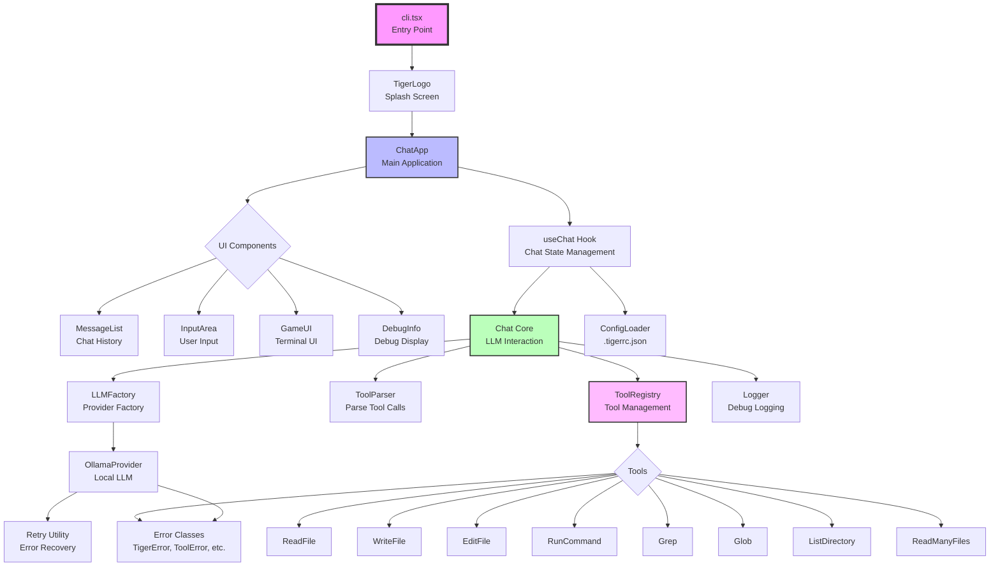

# Tiger CLI アーキテクチャレビュー

## 概要

Tiger CLIは、ローカルLLM（Large Language Model）を活用したCLIベースのコーディングアシスタントです。React/Inkを使用したターミナルUIと、ファイル操作やコマンド実行のためのツールシステムを組み合わせています。

## アーキテクチャ図



## 主要コンポーネント

### 1. **UI層 (React/Ink)**
- **ChatApp**: メインアプリケーションコンポーネント
- **GameUI**: ゲーム風のターミナルUI枠組み
- **MessageList**: チャット履歴の表示
- **InputArea**: ユーザー入力処理
- **DebugInfo**: デバッグ情報表示（開発者向け）

### 2. **ビジネスロジック層**
- **useChat Hook**: チャット状態管理とLLMとの通信
- **Chat Core**: LLMとの対話ロジック、ツール実行管理
- **ToolParser**: LLMレスポンスからツール呼び出しを解析

### 3. **LLM層**
- **LLMFactory**: プロバイダーの生成（将来の拡張性）
- **OllamaProvider**: Ollamaとの通信実装
- ストリーミングレスポンス対応

### 4. **ツール層**
- **ToolRegistry**: ツールの登録・管理
- 8つの基本ツール（ファイル操作、コマンド実行など）
- 各ツールは独自のパラメータ検証と実行確認機能を持つ

### 5. **設定・エラーハンドリング**
- **ConfigLoader**: `.tigerrc.json`から設定を読み込み
- **カスタムエラークラス**: 構造化されたエラーハンドリング
- **Retry Utility**: 一時的なエラーからの自動復旧

## 問題点と改善提案

### 1. **エラーハンドリングの不統一** 🔴
**問題点**:
- カスタムエラークラス（`ToolError`、`FileSystemError`など）が定義されているが、実際のツール実装では使用されていない
- 多くの場所で汎用的な`Error`クラスを使用
- エラーコンテキストが失われる

**改善案**:
```typescript
// 現在の実装
throw new Error(`Failed to read file: ${error.message}`);

// 改善案
throw new FileSystemError(
  ErrorCode.FILE_NOT_FOUND,
  `Failed to read file: ${params.filePath}`,
  params.filePath,
  { operation: 'read' },
  error
);
```

### 2. **設定エラーのサイレント処理** 🟡
**問題点**:
- `.tigerrc.json`のパースエラーが無視される
- ユーザーは設定の問題に気づかない

**改善案**:
- 設定エラーを警告として表示
- デバッグモードで詳細情報を提供

### 3. **ツールパーサーのエラー処理** 🟡
**問題点**:
- JSONパースエラーがコンソールログのみ
- 上位層にエラーが伝播されない

**改善案**:
- パースエラーをユーザーフレンドリーなメッセージで表示
- LLMへのフィードバックメカニズムの実装

### 4. **テスト不足** 🔴
**問題点**:
- テストファイルが最小限
- ツールのテストカバレッジが低い
- 統合テストがない

**改善案**:
- 各ツールのユニットテスト追加
- Chat Coreの統合テスト
- モックを使用したLLMプロバイダーのテスト

### 5. **型安全性の向上余地** 🟡
**問題点**:
- ツールパラメータが`Record<string, unknown>`
- 実行時の型検証に依存

**改善案**:
- Zodなどのランタイム型検証ライブラリの導入
- ツールパラメータの型生成

### 6. **ストリーミングレスポンスの複雑性** 🟡
**問題点**:
- Chat Coreのストリーミング処理が複雑
- ツール実行とストリーミングの統合が難解

**改善案**:
- ストリーミング処理の抽象化
- 状態機械パターンの導入

### 7. **拡張性の考慮** 🟢
**良い点**:
- LLMプロバイダーの抽象化
- ツールレジストリパターン
- 設定ファイルによるカスタマイズ

**さらなる改善案**:
- プラグインシステムの実装
- カスタムツールの動的ロード

## 推奨アクションアイテム

1. **即座に対応すべき項目**:
   - [ ] カスタムエラークラスの一貫した使用
   - [ ] 設定エラーの可視化
   - [ ] 基本的なテストの追加

2. **中期的な改善**:
   - [ ] 型安全性の向上（Zodの導入）
   - [ ] ストリーミング処理のリファクタリング
   - [ ] 包括的なテストスイートの構築

3. **長期的な拡張**:
   - [ ] プラグインシステムの設計・実装
   - [ ] 複数LLMプロバイダーのサポート
   - [ ] より高度なツール（Git操作、デバッガー統合など）

## まとめ

Tiger CLIは、しっかりとした基盤を持つプロジェクトです。アーキテクチャは明確に層分けされており、拡張性も考慮されています。主な改善点は、既に定義されている仕組み（カスタムエラークラス）の一貫した使用と、テストカバレッジの向上です。これらの改善により、より堅牢で保守しやすいコードベースになるでしょう。
